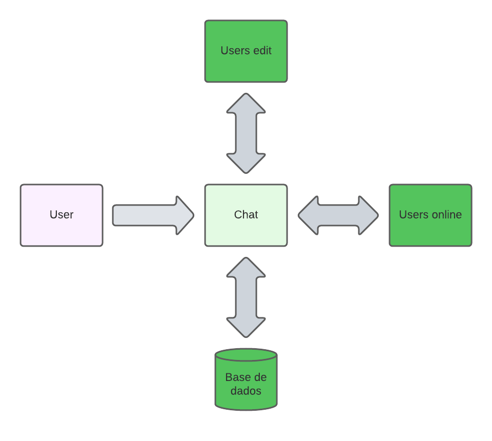

# Aplicação Real Time com Node.js
Este projeto tem como inspiração o livro "Aplicações real time com Node JS" de <autor>. Um dos primcipais objetivos é a produção de uma aplicação com comunicação em tempo real entre os seus usuários. Para isso foi utilizado:
<ol>
    <li>NodeJS para desenvolver o back-end</li>
    <li>MongoDB para armazenamento dos dados do usuários</li>
    <li>Redit para armazenamento das mensagens trocadas entre usuários</li>
</ol>

## Serviços disponíveis
Além de poder se conectar com outros usuários online a aplicação ainda será capaz de armazenar dados da lista de contatos do cliente além de fazer buscas para novos usuários. A aplicação ainda conta com um serviço de [CRUD]() para a lista de usuários e para o próprio usuário.

## Como funciona?

    

O usuário deverá estar logado em sua conta com seu nome de usuário e email. Após, o usuário terá as opções de editar usuários, conversar com usuários online. as mesagens que os usuários trocam entre si ficam salvas, assim como a lista de contatos. Aqueles usuários que disponiveis aparecerá ao lodo de seu nome um icone indicado que aquele usuário está online.

## Tecnologias Usadas

* Node.js
* MongoDB
* Redis
* Express
* Socket.IO
* MongooseJS
* Node Redis
* EJS
* Mocha
* SuperTest
* Nginx

